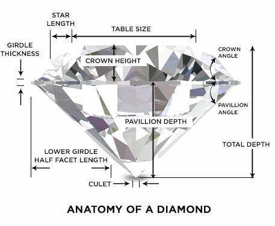

# Diamonds Kaggle Competition
Ironhack Madrid Data Bootcamp

## Overview

The goal of this competition was the prediction of the price of diamonds based on their characteristics (weight, colour, quality of cut, etc.).

I followed the following steps to achieve the goal:
1. Clean the dataset:
    - Label encode some features 
    - Drop highly correlated features
    - Standardize values
    - Apply relative weights to each feature by checking feature importance with Random Forest
2. Train test split to divide my data in X_ train, X_test, y_train, y_test
3. Trained the following models to compute the r2 and MSE of y_pred vs y_test:
    - Linear Regression
    - Random Forest
    - Decision Tree
    - SVR
    - KNeighbors
3. Grid search for Random Forest hyperparameters
4. Train model with all Kaggle train dataset and predict test

